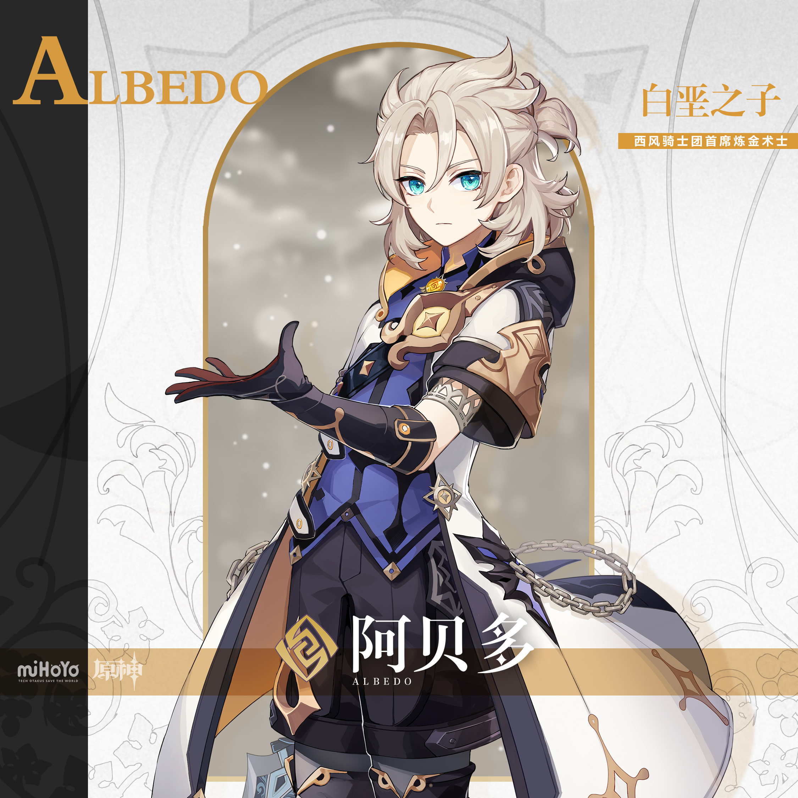
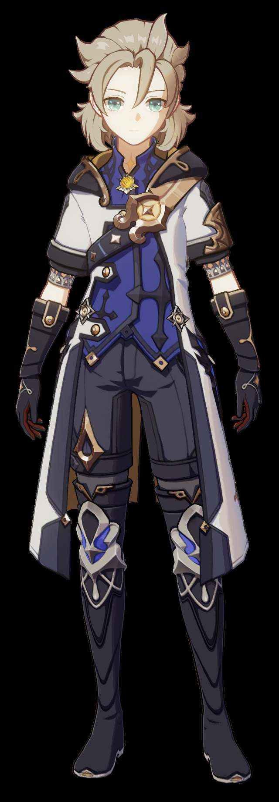
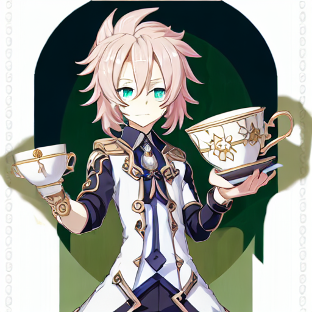

# [DreamBooth](https://github.com/huggingface/diffusers/tree/main/examples/dreambooth) by [Colossal-AI](https://github.com/hpcaitech/ColossalAI.git)

[DreamBooth](https://arxiv.org/abs/2208.12242) is a method to personalize text2image models like stable diffusion given just a few(3~5) images of a subject.
The `train_dreambooth_colossalai.py` script shows how to implement the training procedure and adapt it for stable diffusion.

By accommodating model data in CPU and GPU and moving the data to the computing device when necessary, [Gemini](https://www.colossalai.org/docs/advanced_tutorials/meet_gemini), the Heterogeneous Memory Manager of [Colossal-AI](https://github.com/hpcaitech/ColossalAI) can breakthrough the GPU memory wall by using GPU and CPU memory (composed of CPU DRAM or nvme SSD memory) together at the same time. Moreover, the model scale can be further improved by combining heterogeneous training with the other parallel approaches, such as data parallel, tensor parallel and pipeline parallel.

## Installation

To begin with, make sure your operating system has the cuda version suitable for this exciting training session, which is cuda11.6-11.8. Notice that you may want to make sure the module versions suitable for the whole environment. 

Next, we create the environment required to run the code. This is performed by first initializing a conda environment, followed by installing the necessary dependencies in the `requirements.txt` file via `pip`.

```
# Create and activate conda environment
conda create -n colossalai-dreambooth python=3.10
conda activate colossalai-dreambooth
# Install dependencies
python -m pip install -r requirements.txt
```

### Install [colossalai](https://github.com/hpcaitech/ColossalAI.git)

Next, we also have to install [colossalai](https://github.com/hpcaitech/ColossalAI.git) as the finetuning code utilizes components from this library.

**Via `pip`**
```bash
python -m pip install colossalai
```

**From source**

```bash
git clone https://github.com/hpcaitech/ColossalAI.git
python setup.py install
```

## Dataset
In this example, we use instance images from Teyvat characters in the game Genshin Impact, which can be downloaded from [Fazzie/Teyvat](https://huggingface.co/datasets/Fazzie/Teyvat/tree/main/data). To download and prepare the dataset, run the following commands:

```
# Create the data directory
mkdir data
cd data
# Download the dataset
git lfs install 
git clone https://huggingface.co/datasets/Fazzie/Teyvat/tree/main/data
```

Since Dreambooth is a text-to-image personalization model, we can select several images of a target character from Teyvat characters to generate personalized images with under varying text descriptions. To do this, we first prepare the directory containing images of the target character. Using "Albedo" as the character of choice for this example, we run the following code:

```
mkdir Teyvat/Albedo
cp Teyvat/data/Albedo* Teyvat/Albedo
```

Feel free to replace "Albedo" with any character that you'd like from the Teyvat dataset. For the remainder of this README, "Albedo" is used as the target character for personalization.

## Model Weights
The model used for generation is [Stable Diffusion v1-4](https://huggingface.co/CompVis/stable-diffusion-v1-4), which can be downloaded from HuggingFace. As the training and inference scripts in this repository uses locally saved weights of Stable Diffusion v1-4, please download the weights from HuggingFace to this directory as follows:

```
git lfs install
git clone https://huggingface.co/CompVis/stable-diffusion-v1-4
```

Additionally, run the command ``mkdir ./weights`` to create the directory that model weights will be saved to after finetuning on the set of personalized images, which will be described in the following section.

## Training

To generate target images of a selected character, the Stable Diffusion model is first finetuned on the set of personalization instance images prepared as per the Dataset section. The code for finetuning the model is provided in `train_dreambooth_colossalai.py`, which is executed with the help of a driver file `train_colossalai.sh`. `train_colossalai.sh` has the following example file format for the "Albedo" character:

```bash
pretrained_model_name_or_path="./stable-diffusion-v1-4" # Path to downloaded model weights (See Model section)
instance_data_dir="./data/Teyvat/Albedo" # Path to directory containing target character (See Datasets section)
class_data_dir="./data/Teyvat/data" # Path to original data directory for prior preservation loss 
output_dir="./weights/" # Path to save finetuned personalized UNet weights to (See Model section)
train_batch_size=4

torchrun --nproc_per_node 1 train_dreambooth_colossalai.py \
  --pretrained_model_name_or_path=$pretrained_model_name_or_path  \
  --instance_data_dir=$instance_data_dir \
  --class_data_dir=$class_data_dir \
  --output_dir=$output_dir \
  --instance_prompt="a gsipt anime character" \
  --resolution=512 \
  --plugin="torch_ddp" \
  --with_prior_preservation --prior_loss_weight=1.0 \
  --class_prompt="a anime character" \
  --train_batch_size=$train_batch_size \
  --learning_rate=5e-6 \
  --lr_scheduler="constant" \
  --max_train_steps=800 \
  --num_class_images=200 \
  --save_steps=1000 \
  --test_run=True 

```

where the prompt contains a random phrase ("gsipt") as an identifier for the target character to be personalized. To run the finetuning for the specified model and dataset hyperparameters, simply run the command ``./train_colossalai.sh``.

### Training Hyperparameters

The experiments performed in this repository are run on a single A100 GPU with 40GB of VRAM, hence no parallelism was required. Additionally, the results obtained from the experiments and examples generated (in a later section) uses the following hyperparameters: 

- **plugin**: 4 plugin options are available: `gemini`, `low_level_zero`, `torch_ddp`, `torch_ddp_fp16` where `gemini` and `low_level_zero` involves CPU offloading but slows down training. We use `torch_ddp` as we have sufficient VRAM using a single A100 to train on a small number of instance images.
- **train_batch_size**: A batch size of 4 is used throughout all experiments.
- **max_train_steps**: 800 training steps were used for all experiments.
-- **prior_preservation_loss**: We train with prior preservation loss to prevent overfitting and ensure good quality of generated outputs.

The training logs for the "Albedo" character can be found under `logs/train.txt`.

## Inference

Once you have trained a model using above command, inference is performed simply by executing the `inference.py` file via ``python inference.py``, after defining the desired prompt for generation. Generating personalized images in `inference.py` is done using the `StableDiffusionPipeline`, demonstrated in following inference code snippet:  

```python
from diffusers import StableDiffusionPipeline
import torch

pipe = StableDiffusionPipeline.from_pretrained("./stable-diffusion-v1-4", torch_dtype=torch.float16).to("cuda")
state_dict = torch.load("./weights/diffusion_pytorch_model.bin")
pipe.unet.load_state_dict(state_dict)

prompt = "a gsipt anime character holding a teacup"
image = pipe(prompt, num_inference_steps=100, guidance_scale=7.5).images[0]

image.save("outputs/albedo.png")
```

Here, `prompt` denoting the description for the personalized character should contain the identifier for the target character defined as the instance prompt during the finetuning stage (`"a gsipt anime character"`), furnished with additional details (`"a gsipt character <additional_description>"`). The above code snippet provides an example of how such a prompt can be used. Once the desired description has be defined in `prompt`, a personalized generation can be obtained by running the inference code.

### Inference hyperparameters
We use 100 inference steps for our final generated output (see below). The number of inference steps was experimented with in a range of 25 to 200. We found that 100 gave the most stable generations with a good balance between fidelity and smoothness.

## Example Outputs

We present qualitative examples in the form of images of the "Albedo" character for both the original instance images, as well as the target personalized image generated by our DreamBooth method. These examples can be found under the `images/` folder in this repository.

<table style="width:100%; border-collapse: collapse;" >
  <tr>
    <td style="text-align: center" colspan=2>Instances</td>
    <td style="text-align: center" colspan=1>Generated</td>
  </tr>
  <tr>
    <td colspan=1 style="width:33%"></td>
    <td colspan=1 style="width:33%"></td>
    <td colspan=1 style="width:33%"></td>
  </tr>
  <tr style="border-top: none;">
    <td style="text-align: center" colspan=2>Original "Albedo" Instances</td>
    <td style="text-align: center" colspan=1>Personalized image generated by ColossalAI-DreamBooth using the caption "a gsipt anime character holding a teacup" </td>
  </tr>
</table>
